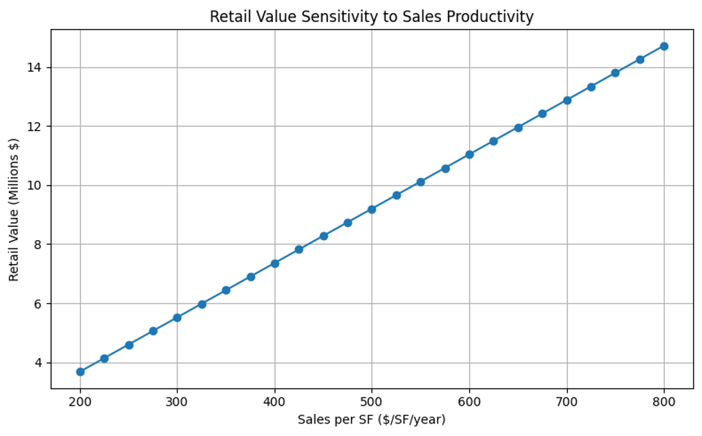

# Retail Systems Analysis

## 1. Overview
Retail is fragile as changes to sales per square foot can drastically change the residual land value (RLV). Declines in sales are also related to increased vacancy, compressed NOI, and cap rate expansion due to higher perceived risk. Retail viability depends on staying above a demand threshold where vacancy and turnover are low and rents are strengthened.

Consistent foot traffic is essential for staying above the demand threshold. While retail may not pencil alone due to the precarious nature of sales revenues, retail can be rationalized when it boosts achievable rents, reduces project cap rates, or strengthens the long-term asset value.

---

## 2. Scenario Summary Table

| Scenario | Retail RLV | System Gain/Loss | Viable? |
|--------|-----------|----------------|--------|
| Standalone | $2,000,000.00 | $52,057,142.86 | Yes |
| Apartment Uplift | -$330,666.67 | $12,583,619.05 | Yes |
| Catalyst | $766,933.33 | $50,824,076.19 | Yes |
| Low Office Occupancy | -$1,017,600.00 | $49,039,542.86 | Yes |

---

## 3. Loss Leader Analysis
The required apartment rent uplift is **0.00579**, which is realistic since it is a fraction of typical rent variation. 

In scenarios where the required apartment rent uplift is unrealistically high relative to comparable projects, public subsidy can be justified if retail generates spillover benefits that are difficult for developers to capture privately.

---

## 4. Sensitivity Chart

---

## 5. Capital Allocation Reflection

If I were allocating public funds, I would support retail development if it were located near a **catalyst such as a university, stadium, or major employment center**, or if there were strong in-person office work in the vicinity.

These factors increase lunchtime foot traffic and help retail remain above the demand threshold identified in the model, improving the probability that retail space remains occupied and financially viable.
